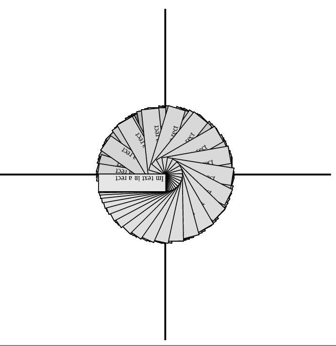

# py-postscript

One-file python generator of the postscript code.

You can use these wrapped in python functions:

+ translate
+ rotate
+ moveto
+ lineto
+ stroke
+ closepath
+ setlinewidth
+ setgray
+ fill
+ line
+ rect
+ square
+ setfont
+ text
+ text_in_cell
+ times
+ for_loop

For more detailed info read source code.

## Running example

[example script](examples/example1.py) outputs code that draws
coordinate system and rotates rectangle with text "Im text in a rect".

### Generated code

```
283.68000000000006 283.68000000000006 translate newpath
-283.68000000000006 0.0 moveto
283.68000000000006 0.0 lineto
2.8368000000000007 setlinewidth
stroke newpath
0.0 283.68000000000006 moveto
0.0 -283.68000000000006 lineto
2.8368000000000007 setlinewidth
stroke 0 1 360 { /index exch def index rotate
0.0 0.0 moveto
0.0 28.368000000000002 rlineto
113.47200000000001 0.0 rlineto
0.0 -28.368000000000002 rlineto
closepath
2.8368000000000007 setlinewidth
gsave stroke grestore
index 0.0025 mul setgray
fill
0 setgray
/LiberationSerif findfont 13 scalefont setfont
2.8368000000000007 2.8368000000000007 moveto
(Im text in a rect)
show } for
```

### Generated image


